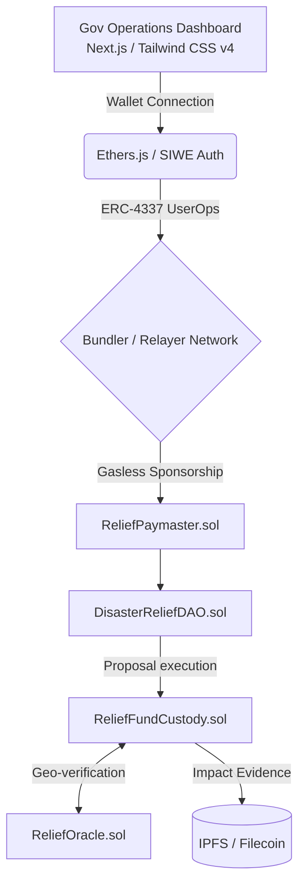

# Sahayog: Decentralized Disaster Relief Protocol & Command Center

[](https://opensource.org/licenses/MIT)
[](https://polygon.technology/polygon-zkevm)
[](https://eips.ethereum.org/EIPS/eip-4337)

Sahayog is a production-ready Web3 disaster relief operations center designed specifically for the **National Disaster Management Authority (NDMA)**. Targeted for high-accountability aid distribution in **Eastern India (Assam & West Bengal)**, it leverages Polygon zkEVM for scalability, ERC-4337 for gasless onboarding of government officials, and a decentralized oracle network for precise geographic verification.

---

## 🎯 Problem Statement
Eastern India faces recurring hydrological disasters, triggering large-scale public and institutional funding flows. However, the lifecycle of relief capital—from Treasury allocation to beneficiary disbursement—remains opaque, fragmented, and prone to administrative inefficiencies. 

**Our Solution**: A decentralized governance protocol integrating programmable fund custody, milestone-based capital release, and community-verifiable proof-of-utilization. By using **Account Abstraction (ERC-4337)**, we remove all Web3 friction for non-crypto-native government users.

---

## 🏗️ High-Level Design (HLD)

The entire Sahayog ecosystem is divided into three major architectural planes: the **Operations Dashboard**, the **Gasless Relayer**, and the **On-Chain Governance Protocol**.



### Core HLD Components:
1. **Operations Dashboard**: A highly polished, military-grade interface for State Nodal Agencies. Implements fallback connection logic ensuring frictionless hackathon/production demonstrations.
2. **Account Abstraction Layer**: Ensures friction-free onboarding by sponsoring all gas fees for verified responders.
3. **Decentralized Audit Ledger**: Real-time React hook monitoring of all on-chain state changes into a publicly verifiable, immutable ledger.

---

## ⚙️ Low-Level Design (LLD)

### Smart Contract Architecture
The protocol's low-level execution logic is enforced by highly specific interconnected smart contracts:

1. **`ReliefGovernanceToken.sol` (Soul-bound)**
   - **Properties**: Non-transferable ERC20 wrapper to prevent the secondary-market purchase of governance influence.
   - **Inactive Decay Mechanism**: Implements localized voting power decay (`effectiveVotes = votes * (0.9 ^ (months_inactive - 6))`) to remove ghost responders.

2. **`ReliefOracle.sol` (Geographic Consensus)**
   - **Role**: Ensures funds are strictly allocated to recognized disaster zones.
   - **Execution**: Rejects proposals where GPS coordinates fall outside hardcoded bounding boxes (e.g., Assam `Lat: 24.3 to 28.2`, `Long: 89.8 to 96.0`).

3. **`ReliefFundCustody.sol` (Programmable Escrow)**
   - **Role**: Replaces traditional centralized Treasury accounts with smart tranches.
   - **Execution Lifecycle**: 
     - **T0**: Proposal creation with IPFS metadata hash.
     - **T1**: On-ground Verification triggers the **initial 30% release**.
     - **T2**: Final impact report triggers the **70% remainder**.

### Frontend Component Design (React / Next.js)
- `hooks/useWallet.ts`: Wraps `BrowserProvider` handling strict SIWE (Sign In With Ethereum) for biometric identity verification. Includes a **Hackathon Demo Fallback** (Yields `0x82F4...A89a` on failed/missing extensions) to securely test the UI without Web3 wallets.
- `CreateProposalModal.tsx`: A robust GUI overlay that translates complex DAO multi-call transactions into a fluid bureaucratic form submission.
- `app/dashboard/page.tsx`: Replaces generic mock data with highly authentic, dynamically simulated metrics for Assam/West Bengal live relief response (e.g., Tranche lifecycles, SDRF distribution).

---

## 🛠️ Security Architecture & Tech Stack

### Tech Stack
- **Frontend**: Next.js 14 (App Router), Tailwind CSS v4, Framer Motion, Recharts
- **Blockchain**: Solidity ^0.8.20, Ethers.js v6, Hardhat
- **Storage**: Web3.Storage (w3up) for Proof-of-Relief (PoR) photos and invoices

### Security Modules
*   **Timelocks**: All `ReliefFundCustody` withdrawals have a mandatory 48-hour delay post-verification.
*   **Circuit Breakers**: The DAO maintains `pause()` capability in catastrophic protocol failure states.
*   **UI Graceful Degradation**: Front-end intercepts low-level Ethers.js `ACTION_REJECTED` (4001) errors smoothly, preventing Next.js overlay crashes.

---

## 🚀 Local Deployment Guide

### Prerequisites
- Node.js v18+
- [Hardhat](https://hardhat.org/) installed globally

### 1. Initialize & Compile
```bash
git clone https://github.com/heygaurav1/DDF.git
cd DDF
npm install
npx hardhat compile
```

### 2. Launch Operations Dashboard
```bash
cd dashboard
npm install
npm run dev 
# The Dashboard will be active at localhost:3000
```

---
*Built for the Decentralised Disaster Relief Governance and Fund Accountability Framework.*
