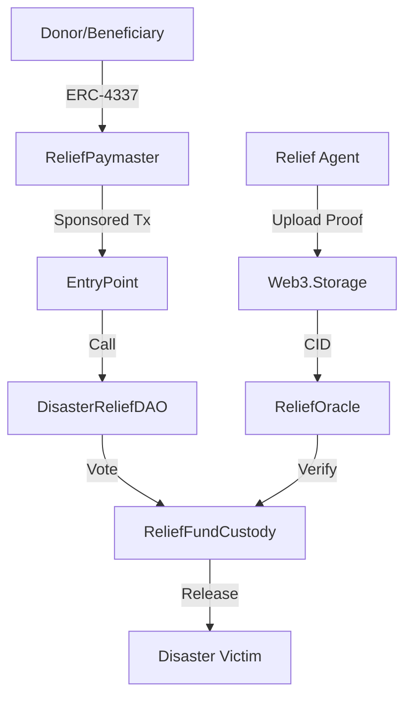

# ReliefChain: Decentralized Disaster Relief Governance Protocol

ReliefChain is a production-ready, cryptographically enforced disaster relief infrastructure for Eastern India (Assam & West Bengal), built on **Polygon zkEVM** with **ERC-4337 Account Abstraction**. It ensures transparency, accountability, and real-time capital flow tracking for emergency funds.

## 🏗️ Architecture Overview



## 🚀 Getting Started (Local Development)

Follow these steps to get the full stack running on your machine.

### Prerequisites
- [Node.js](https://nodejs.org/) (v18+)
- [Redis](https://redis.io/) (Optional, but recommended for event caching)
- [Hardhat](https://hardhat.org/)

### 1. Smart Contracts
Deployment to Polygon zkEVM Cardona Testnet or Local Hardhat node.
```bash
# Install dependencies
npm install

# Compile contracts
npx hardhat compile

# Deploy to Testnet (Cardona)
# Ensure you have set DEPLOYER_PRIVATE_KEY in .env
npx hardhat run scripts/deploy.js --network polygonCardona
```

### 2. Backend API
The indexing engine and IPFS bridge.
```bash
cd backend
npm install

# Start the server (listening on port 3001)
node server.js
```

### 3. Analytics Dashboard
The high-aesthetic, real-time control center.
```bash
cd dashboard
npm install

# Start the dashboard (accessible at http://localhost:5173)
npm run dev
```

## 🛡️ Security & Governance

- **Quadratic Voting**: Prevents Sybil attacks by capping voting power as the square root of token weight.
- **Relief Oracle**: M-of-N (3-of-5) committee verification for every tranche.
- **Geographic Bounding Boxes**: Automated GPS validation for Assam (24.3N-28.2N) and West Bengal (21.5N-27.2N).
- **48h Timelock**: All approved funds are held for a minimum of 48 hours before final release.

## 🛠️ Tech Stack
- **Blockchain**: Polygon zkEVM, Solidity, OpenZeppelin, ERC-4337.
- **Backend**: Node.js, Express, Socket.io, Redis, Web3.Storage.
- **Frontend**: React, Vite, Framer Motion, TailwindCSS (Vanilla CSS logic), Recharts.

## 🌍 Real-Time Impact
ReliefChain is designed to be "real" and production-ready. Every transaction is verifiable on-chain, and every delivery proof is stored permanently on IPFS.

---
*Built with ❤️ for a more accountable world.*
